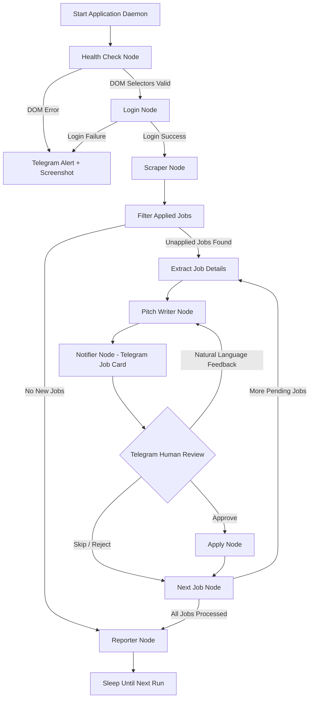

# Osourced Scraper 🤖✉️

> An intelligent, human-in-the-loop automated job scraper and application assistant for **[osourced.is](https://osourced.is/jobs/)**, built with **LangGraph**, **Playwright**, **OpenRouter (GPT-4o-mini)**, and **Telegram**.

---

## 🌟 Overview

**Osourced Scraper** is an agentic automation system designed to streamline job hunting on [osourced.is](https://osourced.is/jobs/). The system automatically scrapes newly posted job opportunities, analyzes requirements and pain points from job descriptions, crafts personalized pitches using LLMs, and delivers interactive job cards directly to your **Telegram** chat for review.

With human-in-the-loop control, you can approve applications with a single tap, direct the AI to revise pitches using natural language (e.g., *"Focus on my backend Python experience"*, *"Keep it under 100 words"*), or skip unwanted postings.

---

## 🚀 Key Features

- **🤖 LangGraph StateGraph Architecture**: Robust state-machine workflow orchestrating pre-flight health checks, authentication, scraping, detail extraction, pitch composition, Telegram feedback loops, auto-applying, and reporting.
- **🌐 Reliable Browser Automation**: Built on **Playwright** and **Scrapling** for reliable DOM navigation, robust scraping, form auto-filling, and automatic screenshot capture on errors.
- **📝 Two-Step AI Pitch Generation**: Employs **GPT-4o-mini** via **OpenRouter** with **Jinja2** prompt templates to first extract key tech stacks & company pain points, then compose tailored pitches (supporting English and German).
- **📱 Interactive Telegram Review Bot**:
  - **Inline Card Actions**: `Approve & Apply`, `Modify Pitch`, `Skip Job`.
  - **Natural Language Rewrites**: Reply directly to any Telegram job card with custom instructions, and the AI will dynamically rewrite the pitch.
  - **Queue Management**: Displays active pending cards one by one for seamless approval flows.
- **🛡️ Dry-Run & Anti-Bot Protections**: Test full pipelines safely without submitting forms (`DRY_RUN=true`). Includes configurable rate-limit delays between applications.
- **⏰ Flexible Daemon Modes**: Supports **Daily Scheduled Mode** (runs at a fixed time in your local timezone, e.g., `09:00 Europe/Berlin`) and **Interval Polling Mode**.
- **📦 Containerized Setup**: Out-of-the-box Docker & Docker Compose setup using Microsoft's official Playwright Python image.
- **💾 Full State & History Persistence**: Maintains permanent records of applied/skipped jobs in [`data/applied_jobs.json`](file:///home/shinobi/Documents/osourced_scraper/data/applied_jobs.json) and logs active pipeline states to [`data/run_state.json`](file:///home/shinobi/Documents/osourced_scraper/data/run_state.json).

---

## 🔄 Workflow Architecture



---

## 📁 Repository Structure

```
osourced_scraper/
├── main.py                     # Application entrypoint & daemon scheduler
├── config.py                   # Environment variable loader & settings validation
├── pyproject.toml              # Poetry package dependencies & project settings
├── Dockerfile                  # Playwright + Poetry production container image
├── docker-compose.yml          # Docker Compose service definition
├── data/
│   ├── applied_jobs.json       # Permanent database of processed/applied jobs
│   └── run_state.json          # Active state serialization for execution tracking
├── db/
│   └── jobs_db.py              # Helper module for JSON job persistence & queries
├── graph/
│   ├── graph.py                # LangGraph StateGraph pipeline assembly & routing
│   ├── state.py                # Graph state definitions and types
│   └── nodes/                  # Individual LangGraph pipeline processing nodes
│       ├── health_check.py     # Pre-flight DOM selector validation
│       ├── login.py            # Playwright authentication node
│       ├── scraper.py          # Job board list scraper
│       ├── filter.py           # Applied jobs filter & deduplication
│       ├── extract_details.py  # Full job page content scraper
│       ├── pitch_writer.py     # LLM pitch generator (Jinja2 templates)
│       ├── notifier.py         # Telegram card notification & queue dispatcher
│       ├── reply_handler.py    # Natural language feedback classifier
│       ├── apply.py            # Automated job application form submitter
│       └── reporter.py         # Final summary report generator
├── telegram_bot/
│   └── bot.py                  # Interactive Telegram bot handler (polling & inline UI)
├── prompts/
│   ├── template_manager.py     # Jinja2 prompt template manager
│   └── templates/              # Prompt templates for pitch generation & extraction
├── logs/                       # Rotating application logs (bot.log)
└── screenshots/                # Browser failure screenshots & inspection captures
```

---

## 🛠️ Prerequisites

- **Python**: 3.10+
- **Poetry**: 1.8+ for dependency management
- **OpenRouter API Key**: For LLM pitch generation (`openai/gpt-4o-mini` or custom model)
- **Telegram Bot & Chat ID**: Created via [@BotFather](https://t.me/BotFather) and [@userinfobot](https://t.me/userinfobot)
- **Osourced Account**: Valid login credentials for `osourced.is`

---

## ⚙️ Installation & Setup

### 1. Clone the Repository

```bash
git clone https://github.com/Yassir-Chakour/osourced-scraper.git
cd osourced-scraper
```

### 2. Install Dependencies via Poetry

```bash
poetry install
```

### 3. Install Playwright Browser Binaries

```bash
poetry run playwright install chromium
poetry run playwright install-deps chromium
```

---

## 🔑 Environment Configuration

Create a `.env` file from the provided example template:

```bash
cp .env.example .env
```

Configure your environment variables in `.env`:

```ini
# Osourced Credentials
OSOURCED_EMAIL=your_email@example.com
OSOURCED_PASSWORD=your_secure_password

# OpenRouter API Configuration
OPENROUTER_API_KEY=sk-or-v1-...

# Telegram Bot Credentials
TELEGRAM_BOT_TOKEN=1234567890:ABC...
TELEGRAM_CHAT_ID=987654321

# Application Operational Settings
MAX_MODIFICATION_ROUNDS=3
DRY_RUN=true
RATE_LIMIT_DELAY=30
CHECK_INTERVAL=900
RUN_MODE=daily
DAILY_RUN_TIME=09:00
TIMEZONE=Europe/Berlin
RUN_ON_STARTUP=true
```

### Environment Variable Reference

| Variable | Required | Default | Description |
| :--- | :---: | :---: | :--- |
| `OSOURCED_EMAIL` | **Yes** | - | Account email for osourced.is |
| `OSOURCED_PASSWORD` | **Yes** | - | Account password for osourced.is |
| `OPENROUTER_API_KEY` | **Yes** | - | OpenRouter API Key for pitch generation |
| `TELEGRAM_BOT_TOKEN` | **Yes** | - | Telegram Bot API Token from @BotFather |
| `TELEGRAM_CHAT_ID` | **Yes** | - | Telegram Chat ID to receive interactive job cards |
| `DRY_RUN` | No | `false` | When `true`, simulates application submission without posting |
| `RUN_MODE` | No | `daily` | Daemon mode: `daily` (scheduled time) or `interval` (recurring poll) |
| `DAILY_RUN_TIME` | No | `09:00` | Time of day (`HH:MM`) for scheduled runs in `daily` mode |
| `TIMEZONE` | No | `Europe/Berlin` | Timezone for scheduled runs |
| `CHECK_INTERVAL` | No | `900` | Delay in seconds between checks in `interval` mode |
| `RATE_LIMIT_DELAY` | No | `30` | Delay in seconds between processing consecutive jobs |
| `MAX_MODIFICATION_ROUNDS` | No | `3` | Maximum rewrite feedback rounds allowed per job pitch |
| `RUN_ON_STARTUP` | No | `true` | Executes a run cycle immediately on service start |

---

## 🏃 Running the Application

### Running Locally (Poetry)

```bash
poetry run python main.py
```

### Running with Docker Compose (Recommended)

To run the scraper daemon in a containerized background process:

```bash
# Build and start services in detached mode
docker compose up -d

# Monitor logs
docker compose logs -f

# Stop services
docker compose down
```

---

## 📱 Telegram Interactive Bot Guide

When the daemon discovers unapplied jobs, it sends interactive job cards to your Telegram chat:

```text
📋 New Job Listing
Title: Senior Python Automation Engineer
Company: TechCorp GmbH
Salary: €75,000 - €90,000 / yr

✉️ Generated Pitch:
Sehr geehrte Damen und Herren,...

[ ✅ Approve & Apply ] [ ✏️ Modify ] [ ❌ Skip ]
```

### Interactive Actions

1. **✅ Approve & Apply**: Accepts the pitch and instructs Playwright to complete the application form on osourced.is (or logs a simulated submission in `DRY_RUN=true` mode).
2. **✏️ Modify**: Prompts you for feedback. Reply with any prompt adjustment, such as:
   - *"Make it shorter and punchier"*
   - *"Emphasize my experience with LangGraph and Playwright"*
   - *"Write the pitch in English instead of German"*
3. **❌ Skip**: Skips the current job and marks it as skipped in [`data/applied_jobs.json`](file:///home/shinobi/Documents/osourced_scraper/data/applied_jobs.json).

---

## 📊 Monitoring & Troubleshooting

- **Application Logs**: Check [`logs/bot.log`](file:///home/shinobi/Documents/osourced_scraper/logs/bot.log) for timestamped execution logs.
- **Pipeline State**: Inspect [`data/run_state.json`](file:///home/shinobi/Documents/osourced_scraper/data/run_state.json) to view real-time state variables of the LangGraph execution loop.
- **Failure Screenshots**: If DOM selector verification or form submission fails, Playwright saves full-page screenshots in the [`screenshots/`](file:///home/shinobi/Documents/osourced_scraper/screenshots) directory and alerts you on Telegram.

---

## 👤 Author & Maintainer

Developed by **Yassir Chakour** ([yassir@shinobiautomation.com](mailto:yassir@shinobiautomation.com)).
